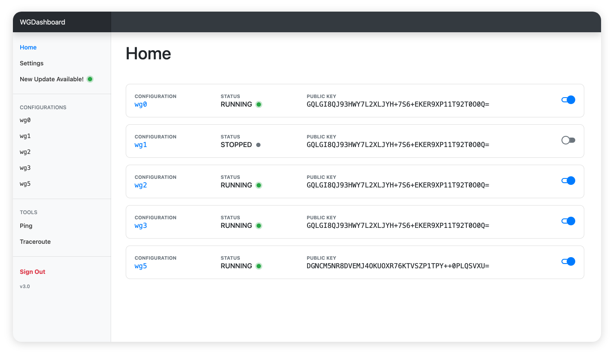
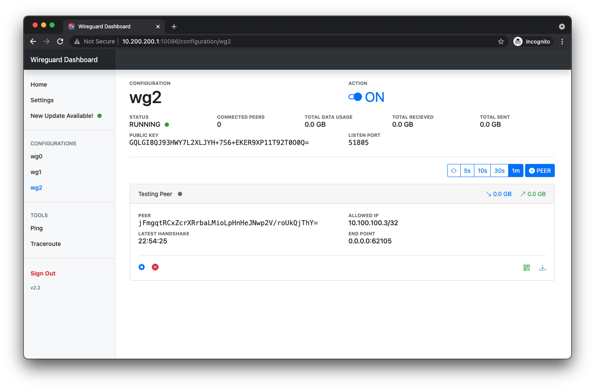
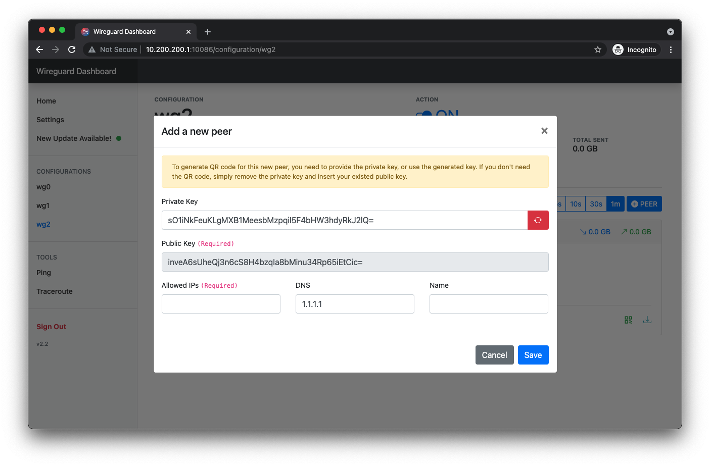
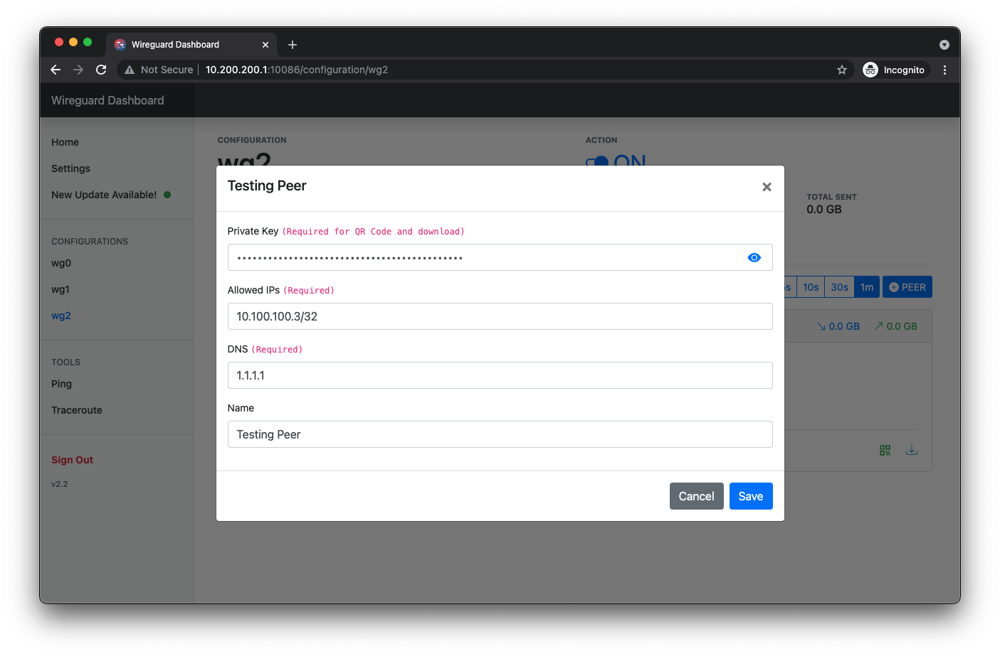
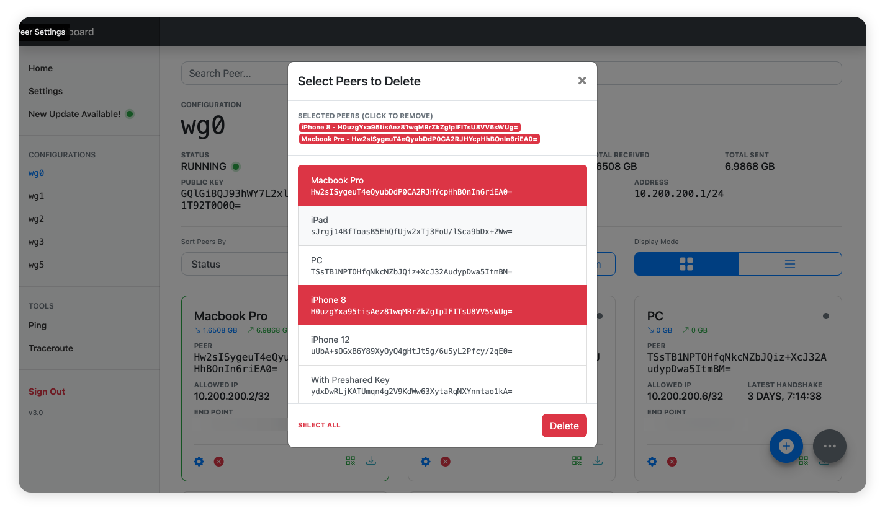
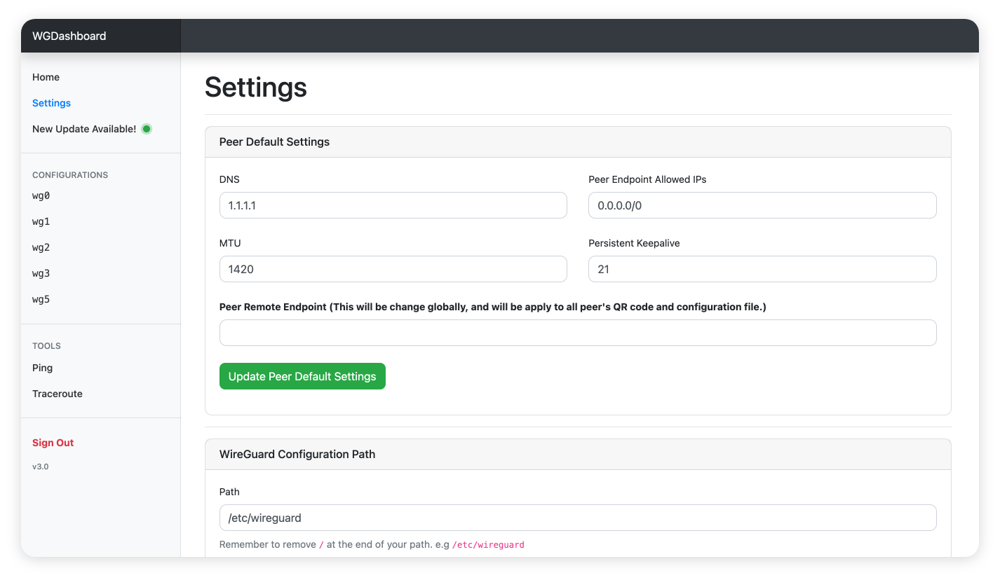
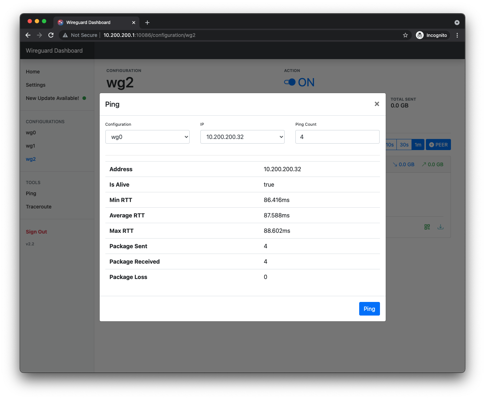
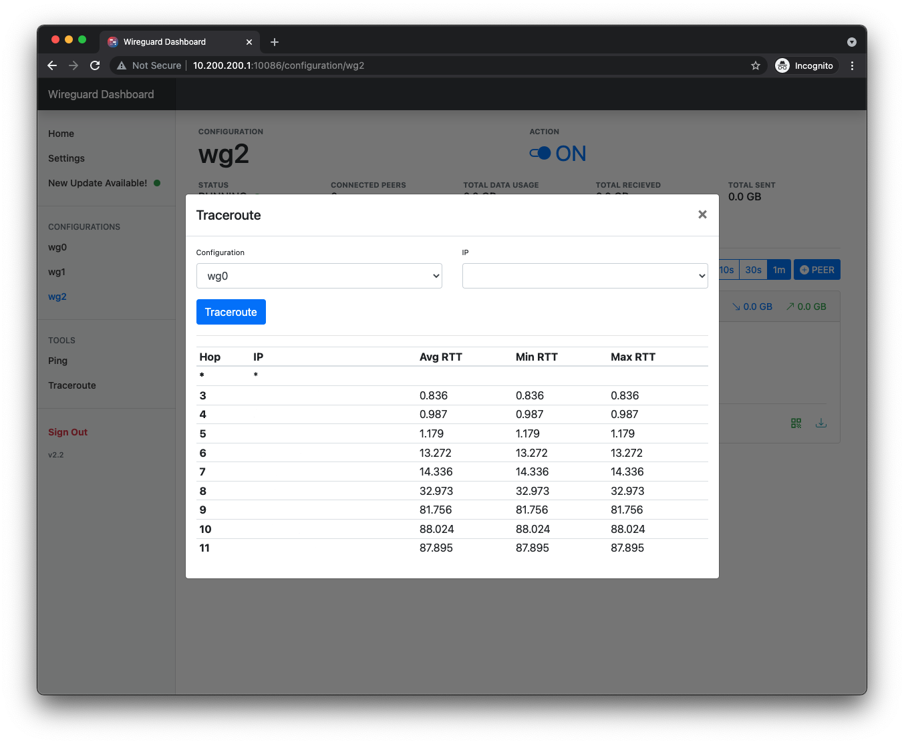

<p align="center">
  
</p>
<h1 align="center">WGDashboard</h1>


<p align="center">
  
</p>
<p align="center">
  <a href="https://github.com/donaldzou/wireguard-dashboard/releases/latest"></a>
  <a href="https://wakatime.com/badge/user/45f53c7c-9da9-4cb0-85d6-17bd38cc748b/project/5334ae20-e9a6-4c55-9fea-52d4eb9dfba6"></a>
</p>
<p align="center">Monitoring WireGuard is not convinient, need to login into server and type <code>wg show</code>. That's why this platform is being created, to view all configurations and manage them in a easier way.</p>
<p align="center"><small>Note: This project is not affiliate to the official WireGuard Project ;)</small></p>

## 📣 What's New: v3.0

- 🎉  **New Features**
  - **Moved from TinyDB to SQLite**: SQLite provide a better performance and loading speed when getting peers! Also avoided crashing the database due to **race condition**.
  - **Added Gunicorn WSGI Server**: This could provide more stable on handling HTTP request, and more flexibility in the future (such as HTTPS support). **BIG THANKS to @pgalonza :heart:**
  - **Add Peers by Bulk:** User can add peers by bulk, just simply set the amount and click add.
  - **Delete Peers by Bulk**: User can delete peers by bulk, without deleting peers one by one.
  - **Download Peers in Zip**: User can download all *downloadable* peers in a zip.
  - **Added Pre-shared Key to peers:** Now each peer can add with a pre-shared key to enhance security. Previously added peers can add the pre-shared key through the peer setting button.
  - **Redirect Back to Previous Page:** The dashboard will now redirect you back to your previous page if the current session got timed out and you need to sign in again.
  - **Added Some [🥘 Experimental Functions](#-experimental-functions)** 
  
- 🪚  **Bug Fixed**
  - [IP Sorting range issues #99](https://github.com/donaldzou/WGDashboard/issues/99) [❤️ @barryboom]
  - [INvalid character written to tunnel json file #108](https://github.com/donaldzou/WGDashboard/issues/108) [❤️ @ikidd]
  - [Add IPv6 #91](https://github.com/donaldzou/WGDashboard/pull/91) [❤️ @pgalonza]
  - [Added MTU and PersistentKeepalive to QR code and download files #112](https://github.com/donaldzou/WGDashboard/pull/112) [:heart: @reafian]
  - **And many other bugs provided by our beloved users** :heart:
- **🧐  Other Changes**
  - **Key generating moved to front-end**: No longer need to use the server's WireGuard to generate keys, thanks to the `wireguard.js` from the [official repository](https://git.zx2c4.com/wireguard-tools/tree/contrib/keygen-html/wireguard.js)! 
  - **Peer transfer calculation**: each peer will now show all transfer amount (previously was only showing transfer amount from the last configuration start-up).
  - **UI adjustment on running peers**: peers will have a new style indicating that it is running.
  - **`wgd.sh` finally can update itself**: So now user could update the whole dashboard from `wgd.sh`, with the `update` command.
  - **Minified JS and CSS files**: Although only a small changes on the file size, but I think is still a good practice to save a bit of bandwidth ;)

*And many other small changes for performance and bug fixes! :laughing:*

>  If you have any other brilliant ideas for this project, please shout it in here [#129](https://github.com/donaldzou/WGDashboard/issues/129) :heart:   

**For users who is using `v2.x.x` please be sure to read [this](#please-note-for-user-who-is-using-v231-or-below) before updating WGDashboard ;)**

<hr>

## Table of Content


- [💡  Features](#-features)
- [📝  Requirement](#-requirement)
- [🛠  Install](#-install)
- [🪜  Usage](#-usage)
  - [Start/Stop/Restart WGDashboard](#startstoprestart-wgdashboard)
  - [Autostart WGDashboard on boot](#autostart-wgdashboard-on-boot--v22)
- [✂️  Dashboard Configuration](#%EF%B8%8F-dashboard-configuration)
  - [Dashboard Configuration file](#dashboard-configuration-file)
  - [Generating QR code and peer configuration file (.conf)](#generating-qr-code-and-peer-configuration-file-conf)
- [❓  How to update the dashboard?](#-how-to-update-the-dashboard)
- [🥘 Experimental Functions](#-experimental-functions)
- [🔍  Screenshot](#-screenshot)
- [⏰  Changelog](#--changelog)
- [🛒  Dependencies](#-dependencies)
- [✨  Contributors](#-contributors)

## 💡 Features

- **No need to re-configure existing WireGuard configuration! It can search for existed configuration files.**
- Easy to use interface, provided username and password protection to the dashboard
- Add peers and edit (Allowed IPs, DNS, Private Key...)
- View peers and configuration real time details (Data Usage, Latest Handshakes...)
- Share your peer configuration with QR code or file download
- Testing tool: Ping and Traceroute to your peer's ip
- **And more functions are coming up!**


## 📝 Requirement

- Recommend the following OS, tested by our beloved users:
  - [x] Ubuntu 18.04.1 LTS - 20.04.1 LTS [@Me]
  - [x] Debian GNU/Linux 10 (buster) [❤️ @[robchez](https://github.com/robchez)]
  - [x] AlmaLinux 8.4 (Electric Cheetah) [❤️ @[barry-smithjr](https://github.com/)]
  - [x] CentOS 7 [❤️ @[PrzemekSkw](https://github.com/PrzemekSkw)]

  > **If you have tested on other OS and it works perfectly please provide it to me in [#31](https://github.com/donaldzou/wireguard-dashboard/issues/31). Thank you!**

- **WireGuard** and **WireGuard-Tools (`wg-quick`)**  are installed.

  > Don't know how? Check this <a href="https://www.wireguard.com/install/">official documentation</a>

- Configuration files under **`/etc/wireguard`**, but please note the following sample

  ```ini
  [Interface]
  ...
  SaveConfig = true
  # Need to include this line to allow WireGuard Tool to save your configuration, 
  # or if you just want it to monitor your WireGuard Interface and don't need to
  # make any changes with the dashboard, you can set it to false.
  
  [Peer]
  PublicKey = abcd1234
  AllowedIPs = 1.2.3.4/32
  # Must have for each peer
  ```

- Python 3.7+ & Pip3

- Browser support CSS3 and ES6

## 🛠 Install
1. Download WGDashboard

   ```shell
   git clone -b v3.0.3 https://github.com/donaldzou/WGDashboard.git wgdashboard
   
2. Open the WGDashboard folder

   ```shell
   cd wgdashboard/src
   ```
   
3. Install WGDashboard

   ```shell
   sudo chmod u+x wgd.sh
   sudo ./wgd.sh install
   ```

4. Give read and execute permission to root of the WireGuard configuration folder, you can change the path if your configuration files are not stored in `/etc/wireguard`

   ```shell
   sudo chmod -R 755 /etc/wireguard
   ```

5. Run WGDashboard

   ```shell
   ./wgd.sh start
   ```
   
   **Note**:

   > For [`pivpn`](https://github.com/pivpn/pivpn) user, please use `sudo ./wgd.sh start` to run if your current account does not have the permission to run `wg show` and `wg-quick`.

6. Access dashboard

   Access your server with port `10086` (e.g. http://your_server_ip:10086), using username `admin` and password `admin`. See below how to change port and ip that the dashboard is running with.

## 🪜 Usage

#### Start/Stop/Restart WGDashboard


```shell
cd wgdashboard/src
-----------------------------
./wgd.sh start    # Start the dashboard in background
-----------------------------
./wgd.sh debug    # Start the dashboard in foreground (debug mode)
-----------------------------
./wgd.sh stop     # Stop the dashboard
-----------------------------
./wgd.sh restart  # Restart the dasboard
```

#### Autostart WGDashboard on boot (>= v2.2)

In the `src` folder, it contained a file called `wg-dashboard.service`, we can use this file to let our system to autostart the dashboard after reboot. The following guide has tested on **Ubuntu**, most **Debian** based OS might be the same, but some might not. Please don't hesitate to provide your system if you have tested the autostart on another system.

1. Changing the directory to the dashboard's directory

   ```shell
   cd wgdashboard/src
   ```

2. Get the full path of the dashboard's directory

   ```shell
   pwd
   #Output: /root/wgdashboard/src
   ```

   For this example, the output is `/root/wireguard-dashboard/src`, your path might be different since it depends on where you downloaded the dashboard in the first place. **Copy the the output to somewhere, we will need this in the next step.**

3. Edit the service file, the service file is located in `wireguard-dashboard/src`, you can use other editor you like, here will be using `nano`

   ```shell
   nano wg-dashboard.service
   ```

   You will see something like this:

   ```ini
   [Unit]
   After=network.service
   
   [Service]
   WorkingDirectory=<your dashboard directory full path here>
   ExecStart=/usr/bin/python3 <your dashboard directory full path here>/dashboard.py
   Restart=always
   
   
   [Install]
   WantedBy=default.target
   ```

   Now, we need to replace both `<your dashboard directory full path here>` to the one you just copied from step 2. After doing this, the file will become something like this, your file might be different:

   ```ini
   [Unit]
   After=netword.service
   
   [Service]
   WorkingDirectory=/root/wgdashboard/src
   ExecStart=/usr/bin/python3 /root/wgdashboard/src/dashboard.py
   Restart=always
   
   
   [Install]
   WantedBy=default.target
   ```

   **Be aware that after the value of `WorkingDirectory`, it does not have  a `/` (slash).** And then save the file after you edited it

4. Copy the service file to systemd folder

   ```bash
   $ cp wg-dashboard.service /etc/systemd/system/wg-dashboard.service
   ```

   To make sure you copy the file successfully, you can use this command `cat /etc/systemd/system/wg-dashboard.service` to see if it will output the file you just edited.

5. Enable the service

   ```bash
   $ sudo chmod 664 /etc/systemd/system/wg-dashboard.service
   $ sudo systemctl daemon-reload
   $ sudo systemctl enable wg-dashboard.service
   $ sudo systemctl start wg-dashboard.service  # <-- To start the service
   ```

6. Check if the service run correctly

   ```bash
   $ sudo systemctl status wg-dashboard.service
   ```

   And you should see something like this

   ```shell
   ● wg-dashboard.service
        Loaded: loaded (/etc/systemd/system/wg-dashboard.service; enabled; vendor preset: enabled)
        Active: active (running) since Tue 2021-08-03 22:31:26 UTC; 4s ago
      Main PID: 6602 (python3)
         Tasks: 1 (limit: 453)
        Memory: 26.1M
        CGroup: /system.slice/wg-dashboard.service
                └─6602 /usr/bin/python3 /root/wgdashboard/src/dashboard.py
   
   Aug 03 22:31:26 ubuntu-wg systemd[1]: Started wg-dashboard.service.
   Aug 03 22:31:27 ubuntu-wg python3[6602]:  * Serving Flask app "WGDashboard" (lazy loading)
   Aug 03 22:31:27 ubuntu-wg python3[6602]:  * Environment: production
   Aug 03 22:31:27 ubuntu-wg python3[6602]:    WARNING: This is a development server. Do not use it in a production deployment.
   Aug 03 22:31:27 ubuntu-wg python3[6602]:    Use a production WSGI server instead.
   Aug 03 22:31:27 ubuntu-wg python3[6602]:  * Debug mode: off
   Aug 03 22:31:27 ubuntu-wg python3[6602]:  * Running on all addresses.
   Aug 03 22:31:27 ubuntu-wg python3[6602]:    WARNING: This is a development server. Do not use it in a production deployment.
   Aug 03 22:31:27 ubuntu-wg python3[6602]:  * Running on http://0.0.0.0:10086/ (Press CTRL+C to quit)
   ```

   If you see `Active:` followed by `active (running) since...` then it means it run correctly. 

7. Stop/Start/Restart the service

   ```bash
   sudo systemctl stop wg-dashboard.service      # <-- To stop the service
   sudo systemctl start wg-dashboard.service     # <-- To start the service
   sudo systemctl restart wg-dashboard.service   # <-- To restart the service
   ```

8. **And now you can reboot your system, and use the command at step 6 to see if it will auto start after the reboot, or just simply access the dashboard through your browser. If you have any questions or problem, please report it in the issue page.**

## ✂️ Dashboard Configuration

#### Dashboard Configuration file

Since version 2.0, WGDashboard will be using a configuration file called `wg-dashboard.ini`, (It will generate automatically after first time running the dashboard). More options will include in future versions, and for now it included the following configurations:

|                              | Description                                                  | Default                                              | Edit Available |
| ---------------------------- | ------------------------------------------------------------ | ---------------------------------------------------- | -------------- |
| **`[Account]`**              | *Configuration on account*                                   |                                                      |                |
| `username`                   | Dashboard login username                                     | `admin`                                              | Yes            |
| `password`                   | Password, will be hash with SHA256                           | `admin` hashed in SHA256                             | Yes            |
|                              |                                                              |                                                      |                |
| **`[Server]`**               | *Configuration on dashboard*                                 |                                                      |                |
| `wg_conf_path`               | The path of all the Wireguard configurations                 | `/etc/wireguard`                                     | Yes            |
| `app_ip`                     | IP address the dashboard will run with                       | `0.0.0.0`                                            | Yes            |
| `app_port`                   | Port the the dashboard will run with                         | `10086`                                              | Yes            |
| `auth_req`                   | Does the dashboard need authentication to access, if `auth_req = false` , user will not be access the **Setting** tab due to security consideration. **User can only edit the file directly in system**. | `true`                                               | **No**         |
| `version`                    | Dashboard Version                                            | `v3.0.3`                                             | **No**         |
| `dashboard_refresh_interval` | How frequent the dashboard will refresh on the configuration page | `60000ms`                                            | Yes            |
| `dashboard_sort`             | How configuration is sorting                                 | `status`                                             | Yes            |
|                              |                                                              |                                                      |                |
| **`[Peers]`**                | *Default Settings on a new peer*                             |                                                      |                |
| `peer_global_dns`            | DNS Server                                                   | `1.1.1.1`                                            | Yes            |
| `peer_endpoint_allowed_ip`   | Endpoint Allowed IP                                          | `0.0.0.0/0`                                          | Yes            |
| `peer_display_mode`          | How peer will display                                        | `grid`                                               | Yes            |
| `remote_endpoint`            | Remote Endpoint (i.e where your peers will connect to)       | *depends on your server's default network interface* | Yes            |
| `peer_mtu`                   | Maximum Transmit Unit                                        | `1420`                                               |                |
| `peer_keep_alive`            | Keep Alive                                                   | `21`                                                 | Yes            |

#### Generating QR code and peer configuration file (.conf)

Starting version 2.2, dashboard can now generate QR code and configuration file for each peer. Here is a template of what each QR code encoded with and the same content will be inside the file:

```ini
[Interface]
PrivateKey = QWERTYUIOPO234567890YUSDAKFH10E1B12JE129U21=
Address = 0.0.0.0/32
DNS = 1.1.1.1

[Peer]
PublicKey = QWERTYUIOPO234567890YUSDAKFH10E1B12JE129U21=
AllowedIPs = 0.0.0.0/0
Endpoint = 0.0.0.0:51820
```

|                   | Description                                                  | Default Value                                                | Available in Peer setting |
| ----------------- | ------------------------------------------------------------ | ------------------------------------------------------------ | ------------------------- |
| **`[Interface]`** |                                                              |                                                              |                           |
| `PrivateKey`      | The private key of this peer                                 | Private key generated by WireGuard (`wg genkey`) or provided by user | Yes                       |
| `Address`         | The `allowed_ips` of your peer                               | N/A                                                          | Yes                       |
| `DNS`             | The DNS server your peer will use                            | `1.1.1.1` - Cloud flare DNS, you can change it when you adding the peer or in the peer setting. | Yes                       |
| **`[Peer]`**      |                                                              |                                                              |                           |
| `PublicKey`       | The public key of your server                                | N/A                                                          | No                        |
| `AllowedIPs`      | IP ranges for which a peer will route traffic                | `0.0.0.0/0` - Indicated a default route to send all internet and VPN traffic through that peer. | Yes                       |
| `Endpoint`        | Your wireguard server ip and port, the dashboard will search for your server's default interface's ip. | `<your server default interface ip>:<listen port>`           | Yes                       |

## ❓ How to update the dashboard?

#### **Please note for user who is using `v2.3.1` or below**

- For user who is using `v2.3.1` or below, please notice that all data that stored in the current database will **not** transfer to the new database. This is hard decision to move from TinyDB to SQLite. But SQLite does provide a thread-safe access and TinyDB doesn't. I couldn't find a safe way to transfer the data, so you need to do them manually... Sorry about that :pensive: . But I guess this would be a great start for future development :sunglasses:.

<hr>

#### Update Method 1 (For `v3.0` or above)

1. Change your directory to `wgdashboard/src`

   ```bash
   cd wgdashboard/src
   ```

2. Update the dashboard with the following

   ```bash
   ./wgd.sh update
   ```

   > If this doesn't work, please use the method below. Sorry about that :(

#### Update Method 2


1. Change your directory to `wgdashboard` 
   
    ```shell
    cd wgdashboard/src
    ```
    
2. Update the dashboard
    ```shell
    git pull https://github.com/donaldzou/WGDashboard.git v3.0.3 --force
    ```

3. Install

   ```shell
   ./wgd.sh install
   ```


Starting with `v3.0`, you can simply do `./wgd.sh update` !! (I hope, lol)

## 🥘 Experimental Functions

#### Progressive Web App (PWA) for WGDashboard

- With `v3.0`, I've added a `manifest.json` into the dashboard, so user could add their dashboard as a PWA to their browser or mobile device.


## 🔍 Screenshot


















## ⏰  Changelog

#### v2.3.1 - Sep 8, 2021

- Updated dashboard's name to **WGDashboard**!!

#### v2.3 - Sep 8, 2021

- 🎉  **New Features**
  - **Update directly from `wgd.sh`:** Now you can update WGDashboard directly from the bash script.
  - **Displaying Peers:** You can switch the display mode between list and table in the configuration page.
- 🪚  **Bug Fixed**
  - [Peer DNS Validation Fails #67](issues/67): Added DNS format check. [❤️ @realfian]
  - [configparser.NoSectionError: No section: 'Interface' #66](issues/66): Changed permission requirement for `etc/wireguard` from `744` to `755`. [❤️ @ramalmaty]
  - [Feature request: Interface not loading when information missing #73](issues/73): Fixed when Configuration Address and Listen Port is missing will crash the dashboard. [❤️ @js32]
  - [Remote Peer, MTU and PersistentKeepalives added #70](pull/70): Added MTU, remote peer and Persistent Keepalive. [❤️ @realfian]
  - [Fixes DNS check to support search domain #65](pull/65): Added allow input domain into DNS. [❤️@davejlong]
- **🧐  Other Changes**
  - Moved Add Peer Button into the right bottom corner.

#### v2.2.1 - Aug 16, 2021

Bug Fixed:
- Added support for full subnet on Allowed IP
- Peer setting Save button

#### v2.2 - Aug 14, 2021

- 🎉  **New Features**
  - **Add new peers**: Now you can add peers directly on dashboard, it will generate a pair of private key and public key. You can also set its DNS, endpoint allowed IPs. Both can set a default value in the setting page. [❤️ in [#44](https://github.com/donaldzou/wireguard-dashboard/issues/44)]  
  - **QR Code:** You can add the private key in peer setting of your existed peer to create a QR code. Or just create a new one, dashboard will now be able to auto generate a private key and public key ;) Don't worry, all keys will be generated on your machine, and **will delete all key files after they got generated**. [❤️ in [#29](https://github.com/donaldzou/wireguard-dashboard/issues/29)]  
  - **Peer configuration file download:** Same as QR code, you now can download the peer configuration file, so you don't need to manually input all the details on the peer machine! [❤️ in [#40](https://github.com/donaldzou/wireguard-dashboard/issues/40)]
  - **Search peers**: You can now search peers by their name.
  - **Autostart on boot:** Added a tutorial on how to start the dashboard to on boot! Please read the [tutorial below](#autostart-wireguard-dashboard-on-boot). [❤️ in [#29](https://github.com/donaldzou/wireguard-dashboard/issues/29)]  
  - **Click to copy**: You can now click and copy all peer's public key and configuration's public key.
  - ....
- 🪚  **Bug Fixed**
  - When there are comments in the wireguard config file, will cause the dashboard to crash.
  - Used regex to search for config files.
- **🧐  Other Changes**
  - Moved all external CSS and JavaScript file to local hosting (Except Bootstrap Icon, due to large amount of SVG files).
  - Updated Python dependencies
    - Flask: `v1.1.2 => v2.0.1`
    - Jinja: `v2.10.1 => v3.0.1`
    - icmplib: `v2.1.1 => v3.0.1`
  - Updated CSS/JS dependencies
    - Bootstrap: `v4.5.3 => v4.6.0`
  - UI adjustment
    - Adjusted how peers will display in larger screens, used to be 1 row per peer, now is 3 peers in 1 row.

#### v2.1 - Jul 2, 2021

- Added **Ping** and **Traceroute** tools!
- Adjusted the calculation of data usage on each peers
- Added refresh interval of the dashboard
- Bug fixed when no configuration on fresh install ([#23](https://github.com/donaldzou/wireguard-dashboard/issues/23))
- Fixed crash when too many peers ([#22](https://github.com/donaldzou/wireguard-dashboard/issues/22))

#### v2.0 - May 5, 2021

- Added login function to dashboard
  - ***I'm not using the most ideal way to store the username and password, feel free to provide a better way to do this if you any good idea!***
- Added a config file to the dashboard
- Dashboard config can be change within the **Setting** tab on the side bar
- Adjusted UI
- And much more!

#### v1.1.2 - Apr 3, 2021

- Resolved issue [#3](https://github.com/donaldzou/wireguard-dashboard/issues/3).

#### v1.1.1 - Apr 2, 2021

- Able to add a friendly name to each peer. Thanks [#2](https://github.com/donaldzou/wireguard-dashboard/issues/2) !

#### v1.0 - Dec 27, 2020

- Added the function to remove peers

## 🛒 Dependencies

- CSS/JS
  - [Bootstrap](https://getbootstrap.com/docs/4.6/getting-started/introduction/) `v4.6.0`
  - [Bootstrap Icon](https://icons.getbootstrap.com) `v1.4.0`
  - [jQuery](https://jquery.com) `v3.5.1`
- Python
  - [Flask](https://pypi.org/project/Flask/) `v2.0.1`
  - [ifcfg](https://pypi.org/project/ifcfg/) `v0.21`
  - [icmplib](https://pypi.org/project/icmplib/) `v2.1.1`
  - [flask-qrcode](https://pypi.org/project/Flask-QRcode/) `v3.0.0`

## ✨ Contributors

<!-- ALL-CONTRIBUTORS-BADGE:START - Do not remove or modify this section -->
[](#contributors-)
<!-- ALL-CONTRIBUTORS-BADGE:END -->

Thanks goes to these wonderful people ([emoji key](https://allcontributors.org/docs/en/emoji-key)):

<!-- ALL-CONTRIBUTORS-LIST:START - Do not remove or modify this section -->
<!-- prettier-ignore-start -->
<!-- markdownlint-disable -->
<table>
  <tr>
    <td align="center"><a href="https://github.com/antonioag95"><br /><sub><b>antonioag95</b></sub></a><br /><a href="https://github.com/donaldzou/WGDashboard/commits?author=antonioag95" title="Tests">⚠️</a> <a href="https://github.com/donaldzou/WGDashboard/commits?author=antonioag95" title="Code">💻</a></td>
    <td align="center"><a href="https://github.com/tonjo"><br /><sub><b>tonjo</b></sub></a><br /><a href="https://github.com/donaldzou/WGDashboard/commits?author=tonjo" title="Code">💻</a></td>
    <td align="center"><a href="https://github.com/reafian"><br /><sub><b>Richard Newton</b></sub></a><br /><a href="https://github.com/donaldzou/WGDashboard/commits?author=reafian" title="Code">💻</a></td>
    <td align="center"><a href="http://www.davejlong.com"><br /><sub><b>David Long</b></sub></a><br /><a href="https://github.com/donaldzou/WGDashboard/commits?author=davejlong" title="Code">💻</a></td>
    <td align="center"><a href="http://www.std-soft.com"><br /><sub><b>Markus Neubauer</b></sub></a><br /><a href="https://github.com/donaldzou/WGDashboard/commits?author=marneu" title="Code">💻</a></td>
  </tr>
</table>

<!-- markdownlint-restore -->
<!-- prettier-ignore-end -->

<!-- ALL-CONTRIBUTORS-LIST:END -->

This project follows the [all-contributors](https://github.com/all-contributors/all-contributors) specification. Contributions of any kind welcome!

